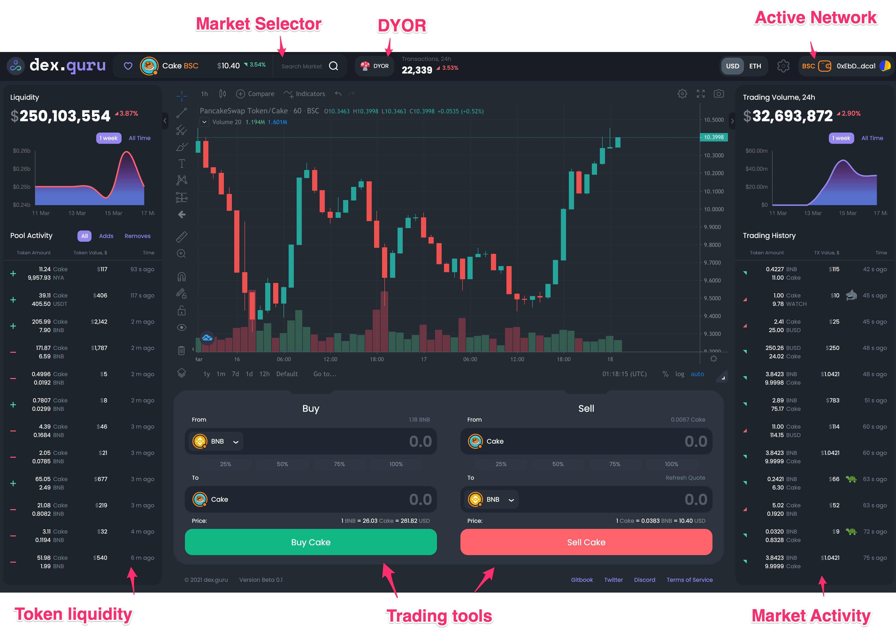

# DexGuru Getting Started

DexGuru is a  trading platform for traders of the DeFi era where on-chain analytics combined with execution capabilities. 

The DexGuru Interface provides access to decentralized protocols on Ethereum and BSC blockchains that allow users to perform certain actions with digital assets or Virtual Currencies.

**Links**

Website: [dex.guru](https://dex.guru) 

Blog: [blog.dex.guru](https://blog.dex.guru)

Twitter: [@dexguru](https://twitter.com/dexguru) 

Github:[ dex-guru](https://github.com/dex-guru/)

Telegram Channel: [@dexguru ](https://t.me/dexguru) 

Discord: [https://discord.gg/dPW8fzwzz9](https://discord.gg/dPW8fzwzz9)

