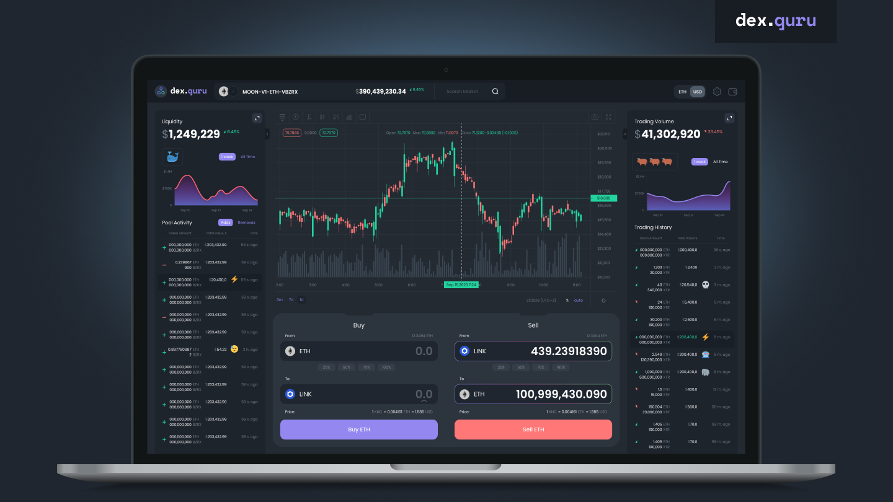

# Dex.Guru Gitbook

Dex.guru is a  trading platform for traders of the DeFi era where on-chain analytics combined with execution capabilities. 

The Dex.Guru Interface provides access to decentralized protocols on the Ethereum blockchain that allows users to perform certain actions with digital assets or Virtual Currencies.

Website: [dex.guru](https://dex.guru) 

Twitter: [@dexguru](https://twitter.com/dexguru) 

Telegram Channel: [@dexguru ](https://t.me/dexguru) 

Discord: [https://discord.gg/dPW8fzwzz9](https://discord.gg/dPW8fzwzz9)

