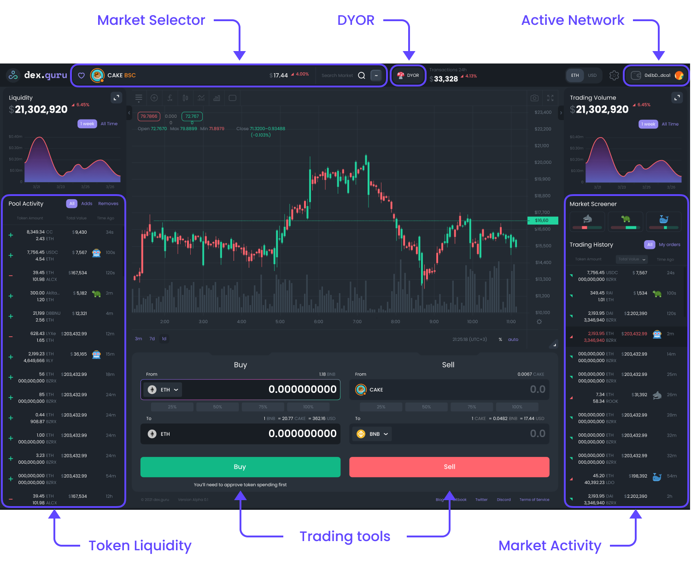

# DexGuru Getting Started

DexGuru is a  trading platform for traders of the DeFi era where on-chain analytics combined with execution capabilities.&#x20;

The DexGuru Interface provides access to decentralized protocols on Ethereum, BSC, Polygon, Avalanche, Fantom, Arbitrum, and CELO blockchains that allow users to perform certain actions with digital assets.

**Links**

Website: [dex.guru](https://dex.guru)&#x20;

Blog: [blog.dex.guru](https://blog.dex.guru)

Twitter: [@dexguru](https://twitter.com/dexguru)&#x20;

Github:[ dex-guru](https://github.com/dex-guru/)

Telegram Channel: [@dexguru ](https://t.me/dexguru)&#x20;

Discord: [https://discord.gg/dPW8fzwzz9](https://discord.gg/dPW8fzwzz9)
