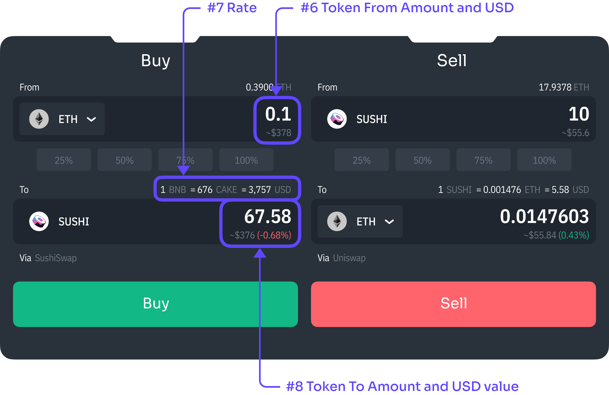
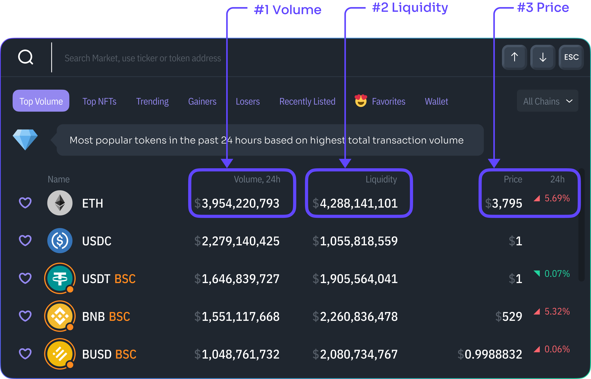
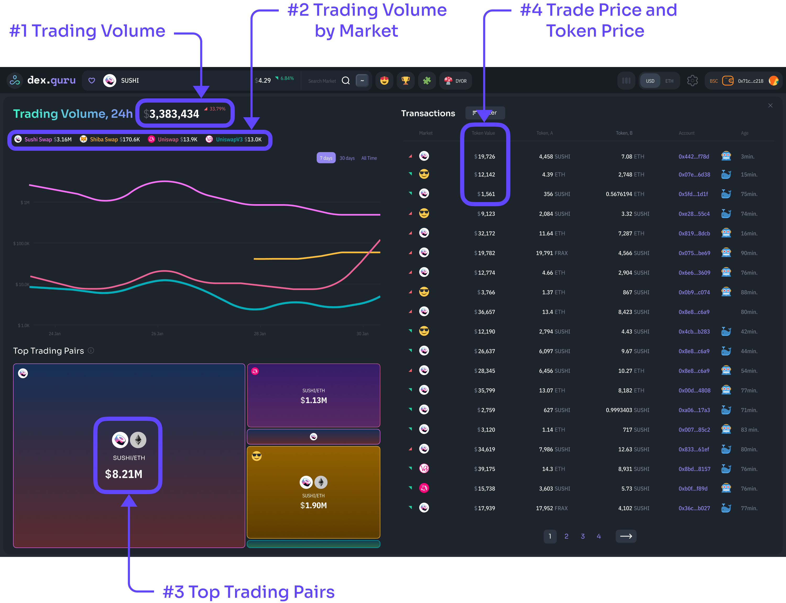

# Data Refreshing

## Main Page


Values on the main page refer to a single token that is currently picked inside [Market Selector](https://docs.dex.guru/general/features/market-selector).


### #1 - Price

Price is based on the latest swap of the token with a USD [stable coin](https://www.coingecko.com/en/categories/stablecoins). If such a swap is unavailable, we look for a different token that was swapped with the former token and recently exchanged with a stable coin. By doing this, we can calculate the USD price of the token in two steps. Right now, the price is refreshed every 30 seconds.

### #2 - Liquidity

Liquidity is calculated for a single token. We add all tokens locked inside [liquidity pools that we support](https://docs.dex.guru/data/supported-dexs-amms) and multiply by the stable coin price. If you keep the page open, this value is updated on every new page load or every 30 minutes.

### #3 - Added/Removed Value in USD

This value is calculated by multiplying the token’s price by the number of tokens added or removed from the liquidity pool during a single transaction. On the main page, [Pool Activity](https://docs.dex.guru/general/features/token-liquidity) transactions are updated every 30 seconds.

### #4 - Trading Volume

Trading Volume is calculated by taking the number of tokens that have been swapped over the last 24 hours across all [supported markets](https://docs.dex.guru/data/supported-dexs-amms) and multiplying it by its latest price. The main page's Trading volume value is updated every 30 minutes.

### #5 - Trade Price and Token Price

Trade Price is calculated by taking the amount of token being swapped during the transaction and multiplying it by the Token Price. Token price is based on the latest swap of the token with a stable coin. If such a swap is unavailable, we look for a different token that was swapped with the former token and recently exchanged with a stable coin. By doing this, we can calculate the USD price of the token in two steps. Trading History transactions are updated every 30 seconds.


&#x20;Values #6, #7, and #8 are not updated automatically, but after 30 seconds, the buy/sell button is disabled, and you will be asked to refresh the quote, which will update all these values.


### #6 - Token From Amount and USD value

You input the amount of token you expect to be taken out of your wallet. Under the token amount, we will calculate an approximation of how much that would be in US dollars. We calculate it by multiplying the number you input by the latest token price. We can’t guarantee an exact USD price due to the nature of decentralized exchanges.

### #7 - Rate

We derive the ratio based on a [0xAPI](https://0x.org/api), 1inch, or Paraswap responses. All orders are routed through their API except the [Arbitrum](https://bridge.arbitrum.io/) chain. Arbitrum orders are routed through [1inch API](https://docs.1inch.io/docs/limit-order-protocol/api/).&#x20;

### #8 - Token To Amount and USD value

The amount of tokens you receive and their USD value is based on a [0xAPI](https://0x.org/api) or [1inch API](https://docs.1inch.io/docs/limit-order-protocol/api/) response. The percentage is calculated by comparing the USD value of the token that is being taken from your wallet to the USD value of the token you are receiving by the end of the transaction.

## Market Selector


All values inside Market Selector refer to a single token and not a pair. All values are updated every time you reopen [Market Selector](https://docs.dex.guru/general/features/market-selector). If you do not close Market Selector, values are updated every 2 minutes automatically.


### #1 - Volume

Volume is calculated by summing up the amount of token that has been swapped over the last 24 hours and multiplying it by its price.

### #2 - Liquidity

Liquidity is calculated by adding all tokens locked inside [liquidity pools that we support](https://docs.dex.guru/data/supported-dexs-amms) and multiplying it by the latest token price.

### #3 - Price

Price is based on the latest swap of the token with a USD [stable coin](https://www.coingecko.com/en/categories/stablecoins). If such a swap is not available, we look for a different token that was swapped with the former token and recently exchanged with a stable coin. By doing this, we can calculate the USD price of the token in two steps.

## Trading Volume Sidebar&#x20;


Values inside Trading Volume Sidebar refer to a single token and not a pair.


### #1 - Trading Volume

Trading Volume is calculated by taking the amount of token that has been swapped over the last 24 hours across all [supported markets](https://docs.dex.guru/data/supported-dexs-amms) and multiplying it by its latest price. The main page's trading volume value is updated every 30 minutes.

### #2 - Trading Volume by Market

Trading Volume by Market is calculated by taking the amount of token that has been swapped over the last 24 and multiplying it by its latest price. Note that these values are the same as those from the last point on the chart. They are updated every 30 minutes.

### #3 - Top Trading Pairs

Top Trading Pairs are liquidity pools with the highest trading volume across all [supported markets](https://docs.dex.guru/data/supported-dexs-amms). Top Trading Pair values are recalculated every 5 minutes on the backend. However, they do not refresh automatically, so you need to reopen the Trading Volume sidebar or change the token inside [Market Selector](https://docs.dex.guru/general/features/market-selector) to update these values.

### #4 - Trade Price and Token Price

Trade Price is calculated by taking the amount of token being swapped and multiplying it by the Token Price. Token Price is based on the latest swap of the token with a USD [stable coin](https://www.coingecko.com/en/categories/stablecoins). If such a swap is unavailable, we look for a different token that was swapped with the former token and recently exchanged with a stable coin. By doing this, we can calculate the USD price of the token in two steps. Transactions inside the Trading Volume sidebar are updated every 30 seconds.

## Liquidity Sidebar

.png>)


Values inside Liquidity Sidebar refer to a single token and not a pair.


### #1 - Liquidity

Liquidity is calculated by adding all tokens locked inside [liquidity pools that we support](https://docs.dex.guru/data/supported-dexs-amms) and multiplying it by the token’s price. If you keep the page open, this value is updated on every new page load or every 30 minutes.

### #2 - Liquidity by Market

We multiply the number of tokens locked inside the market’s liquidity pools and multiply it by the latest token price. Note that these values are the same as those from the last point on the chart. They are updated every 30 minutes.

### #3 - Top TVL Pairs

Total Value Locked is calculated by multiplying the number of tokens inside the liquidity pool by the price. TVL values are recalculated every 5 minutes on the backend. However, they do not refresh automatically, so you need to reopen the Liquidity sidebar or change the token inside [Market Selector](https://docs.dex.guru/general/features/market-selector) to update these values.

### #4 - Transaction’s Token Value

We take the amount of token minted/burned and multiply it by the latest token price. On the first page, transactions are updated every 30 seconds.
