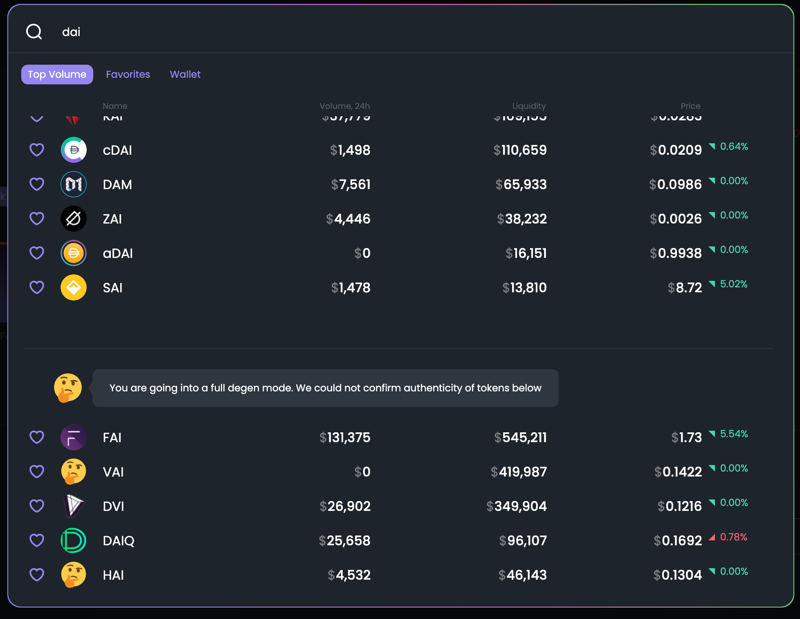

# FAQ

## What is Dex.guru?

Dexguru is a trading terminal that brings together permissionless, real-time data on every DEX market, on-chain research, powerful analytics, and trade execution capabilities — in one fully integrated UI.

## How orders routed?

Orders being routed thru any 0x API connected exchange: 

**on Ethereum network** - Uniswap, Kyber, Curve, Balancer, CREAM, Bancor, mStable, Shell, Swerve, SnowSwap, SushiSwap, DODO, Mooniswap\(1inch protocol AMM\).

**on BSC network** - PancakeSwap, BakerySwap, Mooniswap, DODO\_V2, SushiSwap, Nerve Finance, Belt Finance, Ellipsis.  

## What are 🤔-tokens?

We use [Ethereum token list standard](https://tokenlists.org/) to check the token smart contract address. At least 2 different token lists should have the token listed to get verified status at our UI.

### How to add/update token logo? 

We pull token logos from this repo: [https://github.com/trustwallet/assets](https://github.com/trustwallet/assets)  

 

