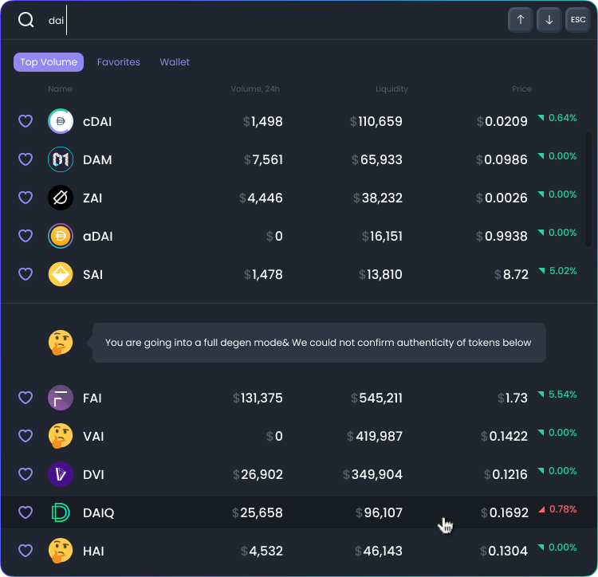

# FAQ

## What is DexGuru?

DexGuru is a trading terminal that brings together permissionless, real-time data on every DEX market, on-chain research, powerful analytics, and trade execution capabilities — in one fully integrated UI.

## How orders routed?

Orders being routed thru any 0x API connected exchange: 

* **on Ethereum network** - Uniswap, Kyber, Curve, Balancer, CREAM, Bancor, mStable, Shell, Swerve, SnowSwap, SushiSwap, DODO, Mooniswap\(1inch protocol AMM\).
* **on BSC network** - PancakeSwap, BakerySwap, Mooniswap, DODO\_V2, SushiSwap, Nerve Finance, Belt Finance, Ellipsis.  
* **on Polygon network** - QuickSwap, SushiSwap, mStable, Curve, Dfyn, Cometh, Dodo

## Is trading on DexGuru free?

Yes! We do not charge any fees for your transactions. Note: You still have to pay network fees \(gas fee\).

## Can I place limit orders and stop orders?

No, we do not support these types of orders. We do not plan to add these features any time soon. We want to keep it this way for a while.

## Why are token approvals necessary?

When you are using a decentralized exchange that is based on smart contracts, you must first approve each token that you plan to trade. Decentralized exchanges use smart contracts on public blockchains such as Ethereum or BSC to execute transactions. To use a smart contract, you must 1\) permit it to validate your token balance, and 2\) allow it to transfer the number of tokens that you wish to trade from your wallet.

## What is a "full degen mode"?

We use [Ethereum token list standard](https://tokenlists.org/)\(and [Binance Smart Chain list](https://bsctokenlists.org/) for BSC\) to check and verify the token smart contract address. At least 2 different token lists should have the token listed to get verified status at our UI. Keep in mind, verified status doesn't mean to be investment advice, a stamp of approval, or any kind of recommendation. It just a sign that a particular token smart contract address is reputable enough and being recognized in the industry with an appropriate ticker. 

## How to add/update token logo? 

We pull token logos from this repo: [https://github.com/trustwallet/assets](https://github.com/trustwallet/assets)  

## What is the process for getting a new token listed on your platform?

We're a permissionless platform, there are no application process or listing fees. If your token has a liquid on-chain market on Uniswap or Pancakeswap it would be automatically indexed and available at Dexguru.

## What is the process for getting a new exchange integrated on your platform?

There are 2 steps needed:

1. Integration with [0x Protocol API](https://0x.org/docs/api), which enables us to route orders via your exchange.  Reach out to the 0x team at their [discord](https://discord.gg/d3FTX3M) or [fill this form to get in touch](https://docs.google.com/forms/d/e/1FAIpQLSf9Xw5M4I8c2Kw1mTkc5LsucrT_3pRuJ6O6RRHPPvn9EXL1tQ/viewform).  
2. Integration in DexGuru UI.   

When your exchange would be available at 0x API we can discuss further integration at Dexguru UI. 

## **How can I invest in your project?**

We good for now, and not looking for new investors.

## When token?

Eventually, we'll have a token. No ETA or any further details to share about it yet.

 

