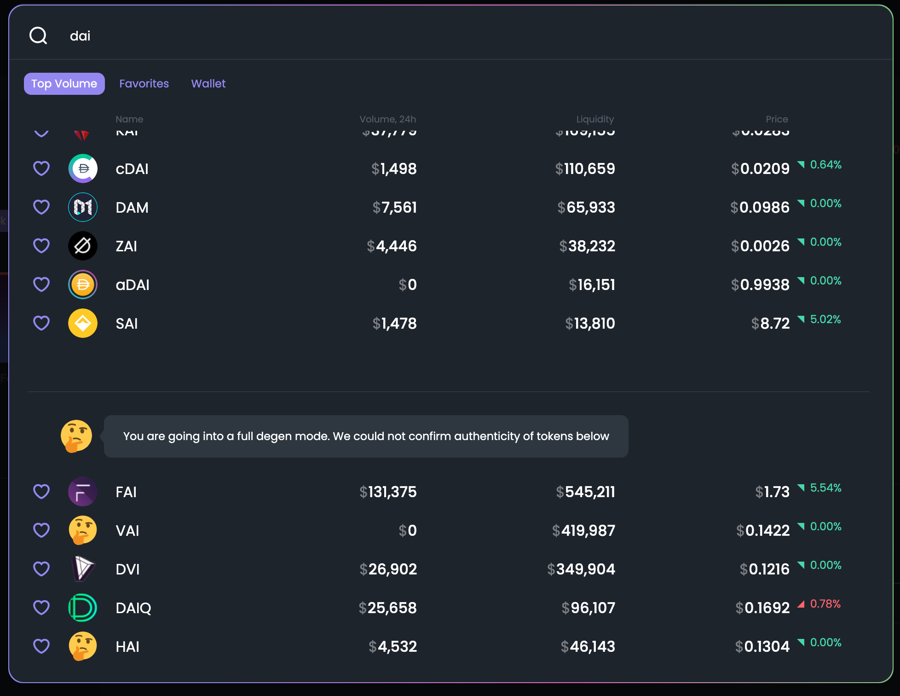

# Market Selector

Explore on-chain markets in the top left corner. It will show the name of a token, its volume over the last 24 hours, and its price. You can search for tokens and add them to your favorites by pressing the heart button.   

Note: All settings are stored on your browser’s local storage. Once you change your browser or clear cache, all settings \(including favorite tokens\) are wiped off.   

In this section, you can also see assets at your connected wallet by pressing under the wallet tab.   
****

## What is a "full degen mode"?

We use [Ethereum token list standard](https://tokenlists.org/) to check and verify the token smart contract address. At least 2 different token lists should have the token listed to get verified status at our UI. Keep in mind, verified status doesn't mean to be investment advice, a stamp of approval, or any kind of recommendation. It just a sign that a particular token smart contract address is reputable enough and being recognized in the industry with an appropriate ticker. 

