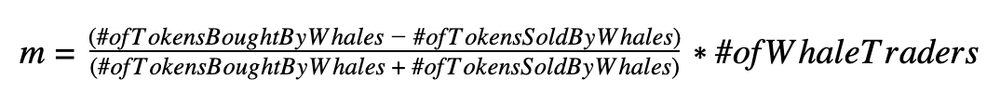
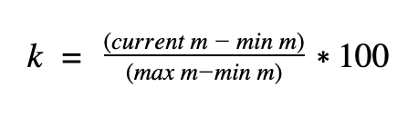

# Trending Tab

**Which tokens get listed inside the Trending Tab?**

The formula below shows how we calculate the _m_ value for each day. The _m_ value is the metric we use for the Market Screener. To pick tokens for the Trending Tab, we compare the current Market Screener \(_m_\) metric to the largest _m_ value __over the last 30 days. Below is the formula for the _m_ value over 24 hours. 

The value _m_ represents the difference between buy volume and sell volume of Whale 🐳 traders \(heavy Trader with $500k+ of a trading volume in the last 30 days\) in the previous 24 hours. The _m_ value is similar to the [Speculative Sentiment Index](https://www.fxcm.com/markets/insights/speculative-sentiment-index-ssi/). The ratio inside the formula determines if the _m_ value is positive or negative. If _m_ is positive, it means more tokens have been bought than sold and vise versa. We multiply the ratio by the number of Whale 🐳 traders to filter tokens with a high probability of manipulation. For example, when one Whale trader buys most of the token’s supply to drive the price up.   

When we calculate the Trending Tab, we consider the maximum and the minimum _m_ values for the previous 30 days. We use the below k indicator similar to the [stochastic oscillator](https://en.wikipedia.org/wiki/Stochastic_oscillator) to determine what tokens we list in the Trending tab. The k indicator value can be between 0 and 100. When _k_ is bigger than 60, the token is considered for the Trending tab. The _k_ indicator shows how close the current _m_ value is to the maximum _m_ over the previous 30 days. We only list tokens with positive _m_ value, where Whale 🐳 buyers strongly dominate Whale 🐳 sellers.

