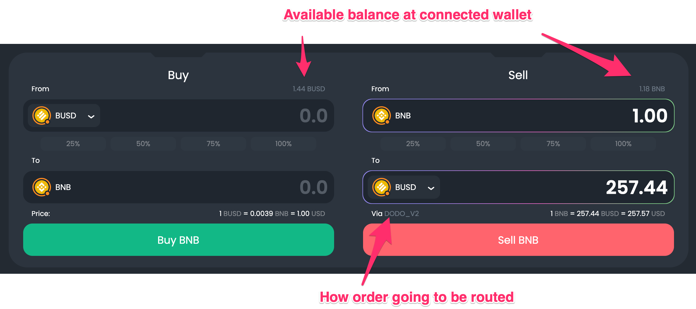

# Trading Tools

Once you connect your web3 wallet, you can exchange one crypto for another directly from the DexGuru interface in the Trading Section. Keep in mind that when you’re buying or selling crypto via our interface, you interact with smart contracts deployed on public chains like Ethereum or BSC. We do not control your transactions and couldn't stop a transaction or attempt to reverse a transaction after it occurred. You’re the only one ultimately responsible for any transactions.    

Use percentage buttons to allocate only that percentage of an asset from your wallet to a given trade. This way, you can sell 50% of all your tokens in 2 clicks. First, by pressing the 50% button and then the sell button. 

Before finalizing a trade, it needs to be verified. Pay close attention to the Swap Verify pop-up shown below.  

Here you can set price slippage, which is a difference between the quoted price and the executed price of your trade.

A tip to DexGuru is optional. We don't charge you additional fees, but your tips are highly appreciated and support our development and help us build the best user experience for our traders. 

The price of Gas shown in GWEI reflects how fast your transaction mined on Ethereum Network. Gas is the fee a user pays to process a transaction on the Ethereum blockchain. Users send transactions with requested gas prices, and then miners choose which transactions they want to mine into a block. In this sense, Ethereum gas prices are dynamic, and the result of equilibrium is reached between what users bid and what miners accept on a rolling basis.

DexGuru will tell you if you are making a shitty trade by placing the 💩 emoji next to the estimated gas costs. 

💩 - shows up when an estimated network fee is more than 25% of the trade size.

The Swap Verify pop-up lets you know if you do not have sufficient balance to cover a transaction, including gas fees. 

  
****We use 0x API to route orders most efficiently. Orders being routed thru any 0x API connected exchange: 

on Ethereum network - Uniswap, Kyber, Curve, Balancer, CREAM, Bancor, mStable, Shell, Swerve, SnowSwap, SushiSwap, DODO, Mooniswap\(1inch protocol AMM\).

on BSC network - PancakeSwap, BakerySwap, Mooniswap, DODO\_V2, SushiSwap, Nerve Finance, Belt Finance, Ellipsis. 

