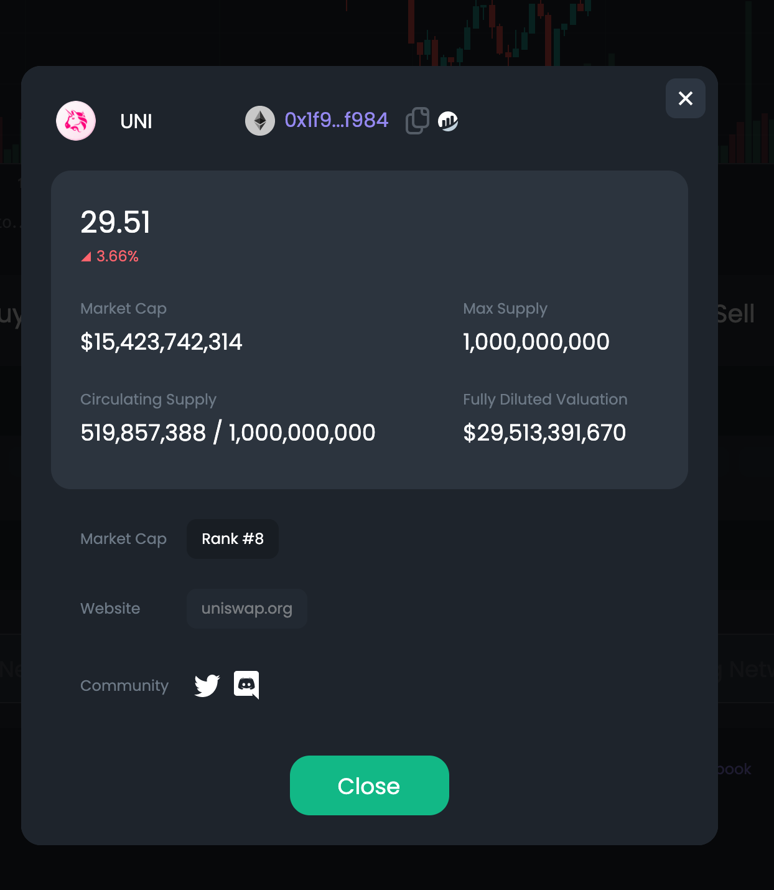

# DYOR🍄

To take a more thorough look at how a token has been performing, use the 🍄 DYOR button.   

The button will show in-depth information about the token. To specify the token, you want to pick it in the [Market Selector](https://docs.dex.guru/features/market-selector) area before pressing the 🍄 DYOR button.   

