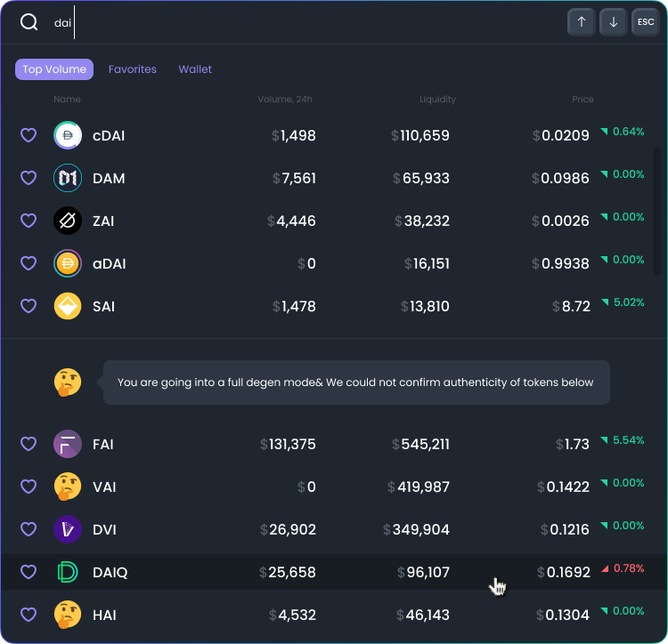

# FAQ

## What is DexGuru?

DexGuru is a trading terminal that focuses on providing the best trading experience possible. We strive to bring the following all under one easy to use integrated UI:

* Real-time Data across all DEX Markets
* On-Chain Research
* Powerful Data Analytics
* Token Swap Execution Capabilities

Our goal is to make it easy for all traders to leverage on-chain data in a simple, understandable and timely way and enabling them to make the best possible decisions in real-time.

To learn more about DexGuru and what we're all about, visit our [Manifesto on our blog](https://blog.dex.guru/manifesto)!

## Is DexGuru free to use? And does trading on DexGuru cost anything extra?

Yes! DexGuru is currently completely free to use. All features on the DexGuru are available to everyone once they have connected their wallet.&#x20;

Trading tokens on DexGuru is also completely free, but bear in mind you will still need to pay Network Transaction Fees (Gas Fees) as you would if you were normally swapping on a DEX/AMM.&#x20;


We do have future plans to introduce and add premium subscription plans for more comprehensive and advanced features! Keep on the look out :eyes:


## How **are Token Swap O**rders being routed?

All swaps on DexGuru are routed through the 0x Protocol API. All orders are optimized through their exchange network.  Below is their currently supported DEX/AMMs.

\<TABLE> or OUTLINK TO 0X PROTOCOL API documentation. (Waiting for 0x protocol/matcha team to reply with docs)

For more details about 0x Protocol API and how token swaps work on DexGuru, please visit [swapping-tokens.md](../more-info/swapping-tokens.md "mention")

## Do I need to connect my Wallet to use DexGuru?&#x20;

No, you don't have to connect your wallet to use DexGuru if you choose not to, but some features will be limited. We encourage users to connect their wallet as it provides full access to the DexGuru platform, along with allowing you to save tokens to your favorites, buy and sell tokens, setting price alerts & more!&#x20;

## Why am I asked for a Signature Request when connecting my Wallet? And token approvals before swapping?

When you connect your wallet for the first time on a new device, you will be asked for a Signature request to verify you are the owner of the address. There are no blockchain transactions, gas fees or approvals associated with this at all, so feel rest assured that your funds are SAFU!

Additionally, you will be asked for token approvals before swapping a token on DexGuru to allow the smart contract to spend your tokens from your wallet in exchange for the one that you are buying. This type of Token approval is exactly the same as if you were swapping directly on a DEX/AMM and will cost a small Network Transaction fee (gas fee) as it is a transaction on the blockchain.

For more in-depth information about Signature Requests, Token Approvals and using your Wallet on DexGuru, check out the [wallets-security-and-more.md](../more-info/wallets-security-and-more.md "mention") section.

## What is the "Full Degen Mode" inside the Market Selector?

Tokens that are fall under the Full Degen Mode in the [market-selector](features/market-selector/ "mention") are tokens that are not on at least 2 verified Token Lists.&#x20;

### **What exactly are token lists?**

Token lists are an industry standard created by Uniswap to help users navigate the vast number of tokens in the world of crypto. Since anyone can create tokens, it's become for bad actors to create scams, fakes or duplicate tokens to take advantage of market participants. Token lists are created and approved by reputable parties in the Crypto industry to help users interact with authentic tokens.

Directly from Uniswap's [official blog post on Token Lists](https://uniswap.org/blog/token-lists):

> _As the rate of token issuance accelerates, it has become increasingly difficult for users to filter out high quality, legitimate tokens from scams, fakes, and duplicates. Across the space, projects are managing and maintaining rapidly growing token lists. The end result is a lot of wasted time, slow listing processes and scammed users. In addition, builders should spend their time building, not deciding which tokens are legitimate and which are scams, fakes or duplicates._
>
> __\
> _Today, we are excited to announce_ [_Token Lists_](https://tokenlists.org)_, a new standard for creating lists of ERC20 tokens. This is a community-led initiative to improve discoverability and trust in ERC20 token lists in a manner that is inclusive, transparent, and decentralized._

For more information about Token Lists, check out the full [Uniswap official blog post](https://uniswap.org/blog/token-lists) that covers everything you need to know.

For more information on the exact sources of the token lists that we use, check out [off-chain-data-usage.md](../data/off-chain-data-usage.md "mention").

### How we use Token Lists on DexGuru

We use Token Lists to help provide additional context when browsing Tokens. Keep in mind, **verified status is NOT investment advice, a stamp of approval, or any kind of recommendation**. It is only an indicator that a particular Token is reputable enough to be recognized by a trusted List creator.

Additionally, tokens that are not verified and that fall under Full Degen Mode does not necessarily mean they are fraudulent either - they have just not been vetted and verified by List creators yet.&#x20;

As always, DYOR, double check all Token contract addresses that you're interacting with to ensure they are the right one, especially if they are not on Token Lists.


_You may have previously seen the button "Manage Token Lists" when selecting tokens to swap on leading DEXs, the lists that appear there are likely to be the same ones that we use!_


## How can I add/update a Token's Logo?&#x20;

All token logos are being pulled directly from [Trust Wallet's Asset Repo](https://github.com/trustwallet/assets) for Token Logos. If you are a developer looking to update their Token Logo, please visit Trust Wallet's Asset Repo and follow their instructions on "How to add Logo".

For more information about how Token data is pulled and displayed on DexGuru, please visit our [Broken link](broken-reference "mention") section.

## What does the :thinking: Emoji mean on Token Logos?

The :thinking: is used a placeholder for Tokens that currently do not have their Logo updated on the [Trust Wallet's Asset Repo](https://github.com/trustwallet/assets) where we pull token logos from.&#x20;

## What is the process for getting a new Token listed on DexGuru?

We're a permission-less platform, meaning there is no application process nor listing fees. We automatically index all tokens that are on our [supported-chains.md](../data/supported-chains.md "mention"), have liquidity on at least one of our [supported-dexs-amms.md](../data/supported-dexs-amms.md "mention") and has had recent transactions.&#x20;

For more information about how data makes it way onto DexGuru, please check out our [data-faq.md](../data/data-faq.md "mention") which covers many questions you may have!

## What is the process for getting a new exchange integrated on your platform?

There are 2 steps needed:

1. Integration with [0x Protocol API](https://0x.org/docs/api), which enables us to route orders via your exchange.  Reach out to the 0x team at their [discord](https://discord.gg/d3FTX3M) or [fill this form to get in touch](https://docs.google.com/forms/d/e/1FAIpQLSf9Xw5M4I8c2Kw1mTkc5LsucrT\_3pRuJ6O6RRHPPvn9EXL1tQ/viewform). &#x20;
2. Integration in DexGuru UI.  &#x20;

When your exchange would be available at 0x API we can discuss further integration at Dexguru UI.&#x20;

## **DexGuru is amazing! Is there a way for me to invest in your project?**

We always love the kind comments, enthusiasm and support from the DexGuru community. But we have recently raised funding rounds and not looking for new investors. You can read more about this on our [blog](https://blog.dex.guru)!

## Ser, Wen Token? Wen Airdrop?

Eventually, there will be a DexGuru Token. However, there is currently No ETA or any further details to share about it yet as we're focused on building the best trader experience first!

Additionally, we have no plans to do any airdrops and would like to make it clear that you won't receive anything if you are using DexGuru with an expectation of future airdrops :blush:.&#x20;

