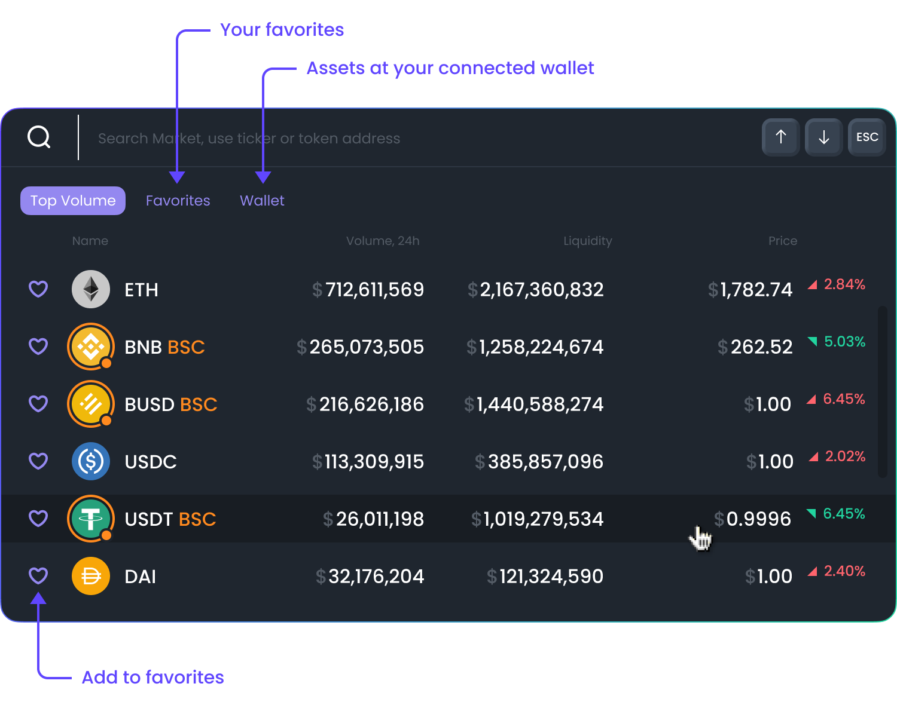

# Market Selector

Explore on-chain markets in the top left corner. It will show the name of a token, its volume over the last 24 hours, and its price. You can search for tokens and add them to your favorites by pressing the heart button. \

Note: Some of our features are only available once you connect a wallet. After connecting it, you will be able to save your favorite tokens by pressing a heart button. DexGuru is a fully non-custodial platform, so the assets in your wallet are always under your control.\

Inside Market Selector, you can also see assets at your connected wallet by pressing under the wallet tab. \
****

There is no need to use your computer mouse to open our Market Selector; use hotkeys instead. Just press the \~ key to open it. Use ↑  ↓ and ESC keys to navigate around and close the Market Selector.&#x20;

\

## What is a "full degen mode"?

.png>)

We use [Ethereum token list standard](https://tokenlists.org) to check and verify the token smart contract address. At least 2 different token lists should have the token listed to get verified status at our UI. Keep in mind, verified status doesn't mean to be investment advice, a stamp of approval, or any kind of recommendation. It just a sign that a particular token smart contract address is reputable enough and being recognized in the industry with an appropriate ticker.&#x20;
