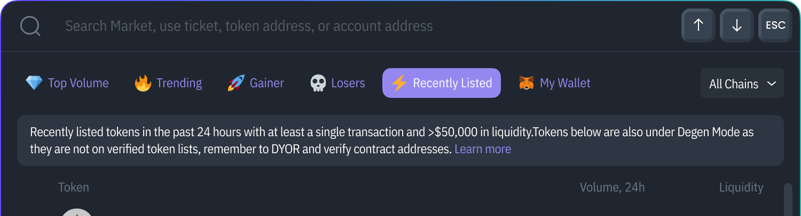

# Multi-Chart

<figure><figcaption></figcaption></figure>

To **open Multi-Chart**, click on the puzzle 🧩 icon in the left navbar.

<figure><figcaption></figcaption></figure>

To **add more charts to the page**, click the “+Add Chart” button in the top right corner.

<figure><figcaption></figcaption></figure>

**Group charts together** and name them.

<figure><figcaption></figcaption></figure>

**Create a new group** without losing old group settings.

<figure><figcaption></figcaption></figure>

**Rename or delete the group** by clicking three dots right next to the group name.

<figure><figcaption></figcaption></figure>

Feel free to close Multi-Chart; the **settings are always saved**.
