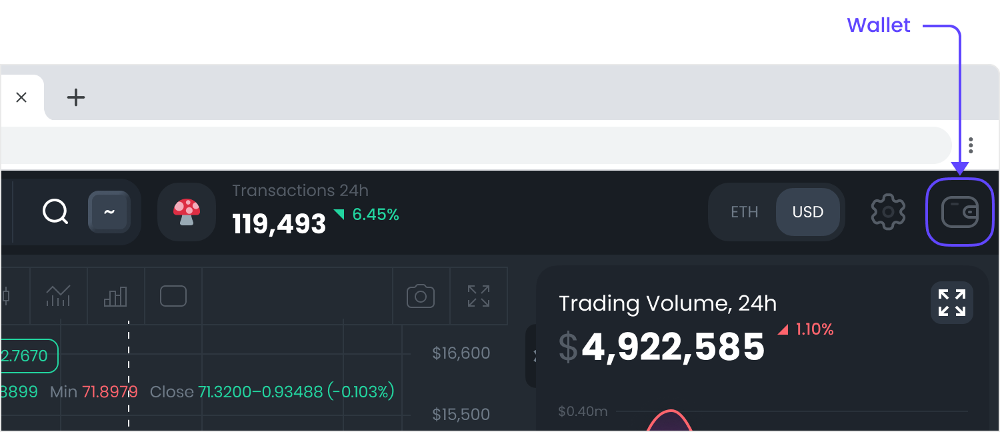
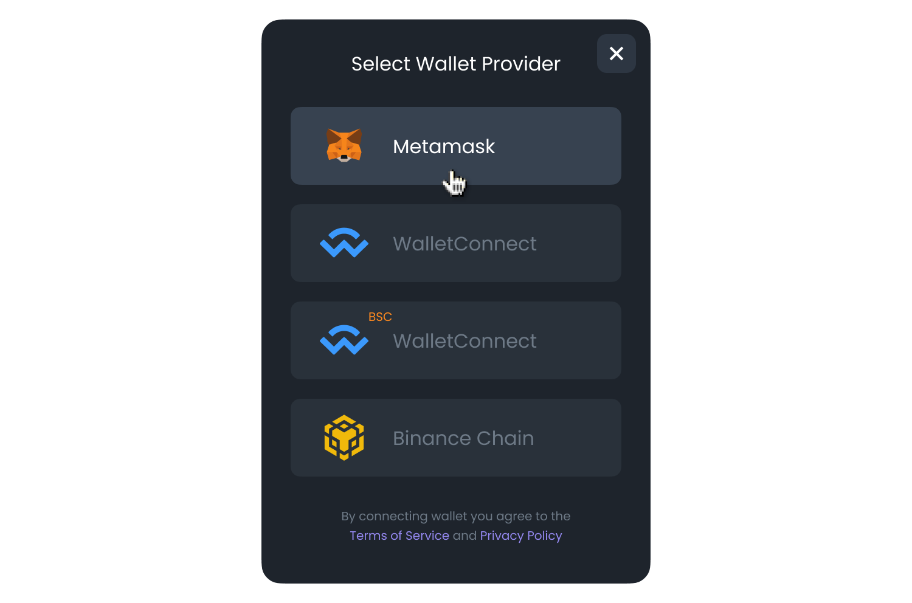
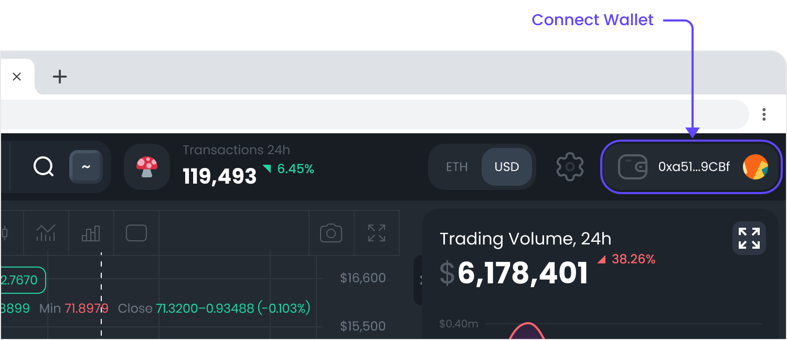
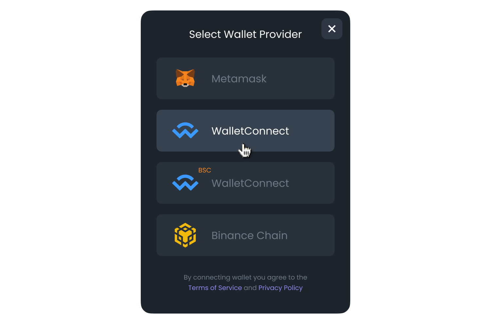

# Connect your Wallet

Some of our features are only available once you connect a wallet. After connecting it, you will be able to save your favorite tokens and change DexGuru settings.

DexGuru is a fully non-custodial platform, so the assets in your wallet are always under your control.

## On desktop&#x20;

### Browser wallets such as Metamask

Click on a wallet icon at the top right corner&#x20;

Choose Metamask&#x20;

We use Signature Requests for authentication. By signing it, you prove that you have a private key for an address.&#x20;

.png>)

All set:&#x20;

### WalletConnect

**Note:** To use WalletConect you need to disable or delete the MetaMask extension on the desktop browser because it causes conflicts with other wallet providers. Another option is to use Incognito mode.&#x20;

Click on a wallet icon at the top right corner&#x20;

Choose Walletconnect&#x20;

Scan QR code from your screen with a WalletConnect-compatible wallet, and confirm a Signature Request. By signing it, you prove that you have a private key for an address.&#x20;

All set:&#x20;

## On mobile&#x20;

You need to have your web3 wallet app installed on your phone. Go to your wallet app and look for the browser there. Now go to dex.guru

Click on a wallet icon at the top right corner&#x20;

Click on Metamask or Trustwallet&#x20;

All set:&#x20;

### TrustWallet. Change Network

1. Click on a wallet icon at the top right corner of Browser
2. Choose Wallet Connect on Browser
3. Scan the QR code on your screen with Trust Wallet App
4. Select your wallet inside the app
5. Select the Network inside the app
6. Approve the signature request in the app
7. Select "save and leave" in the app
8. All done

 (1) (1) (1) (1).png>)

