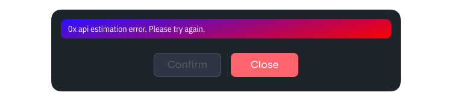

# See my wallet's balance

All transactions and actions with your wallet on a blockchain are recorded; you can check them by using one of the blockchain explorers below.&#x20;

[**Etherscan**](https://etherscan.io) **** is a Block Explorer for Ethereum Network. \
****[**BscScan**](https://bscscan.com) **** is a Block Explorer for Binance Smart Chain. \
[**Polygonscan**](https://polygonscan.com) **** for Polygon Network. \
[**Avascan**](https://avascan.info) **** for Avalanche Network. \

If you do not see assets in your wallet, it is a good idea to check your wallet’s address on a blockchain explorer. Use **** [**Etherscan**](https://etherscan.io) **** for **Ethereum** transactions, [**BscScan**](https://bscscan.com) **** for **Binance Smart Chain** transactions, and so on. **** \
****

Copy your wallet’s public address and search for it on a blockchain explorer.

After entering your public address, you will see your ETH or BNB balance in native value. You will also see all up-to-date transactions that happened to your wallet. To view Expanded Token Holdings click on the button next to the value of your custom tokens.

.png>)

Wallets like MetaMask display a limited list of standard token balances but do not display current balances for custom tokens. You have to add a custom token to your wallet manually. All you need is a Token Contract Address that you can find on [**Etherscan**](https://etherscan.io) **** for ERC-20 tokens and **** [**BscScan**](https://bscscan.com) **** for BEP-20 tokens. \
****

Go to your Token Holdings, find the token you want to add to your wallet, and press it. Copy the Contract Address. You will need to add it to your wallet.

.png>)

If you are using MetaMask, go to your Assets, scroll down, and press “Add Token”

.png>)

Press “Custom Token.” Make sure you are connected to the correct network (ETH or BSC).

.png>)

Now paste the Token Contract Address. Token Symbol and Decimals of Precision will be filled automatically.

