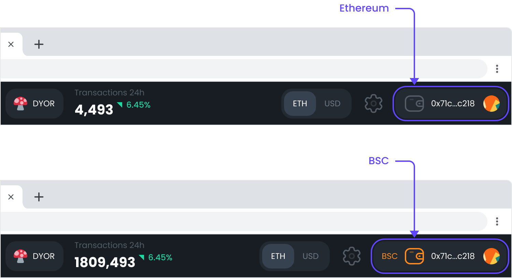
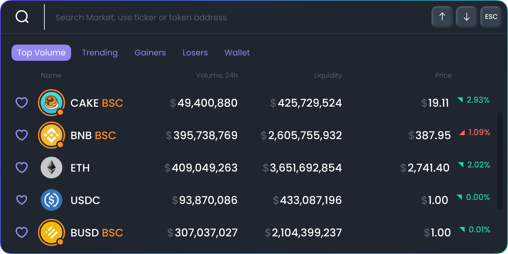
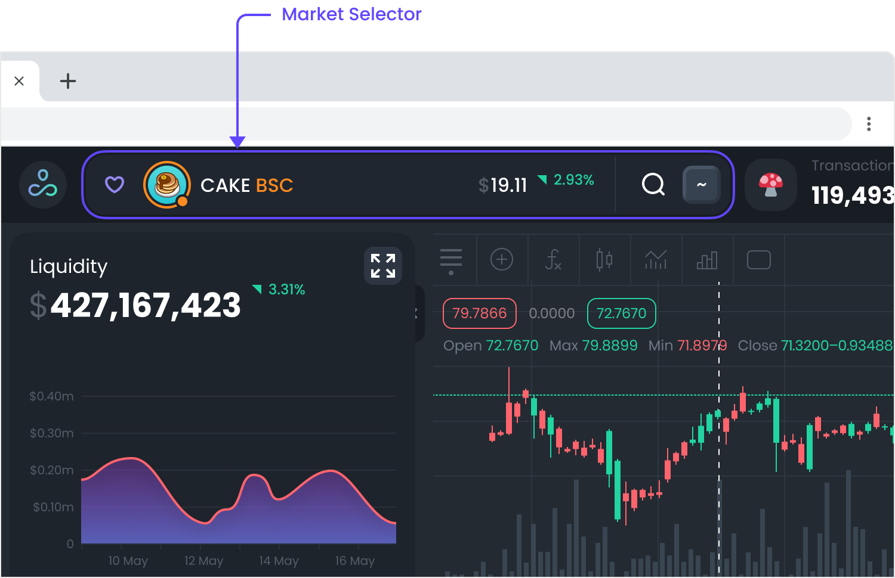
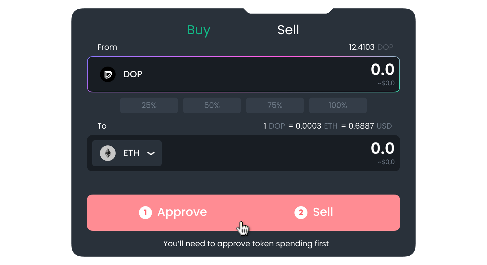
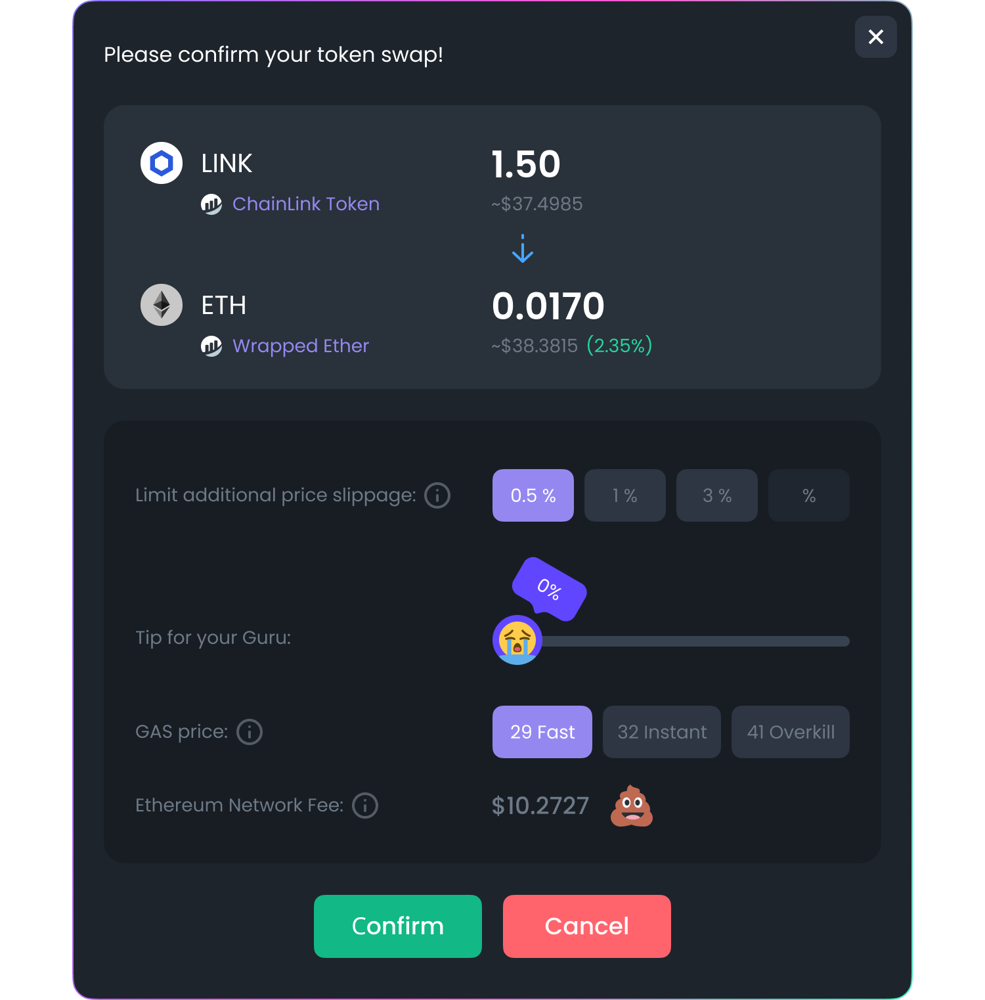

# Buy/Sell

**1. Firstly, you need to** [**connect your wallet**](https://docs.dex.guru/how-to/connect-wallet)**.**

**2.** **Make sure your wallet is using the correct network.** You can see what network you are connected to in the upper right corner next to a wallet icon.

DexGuru makes it easy to identify tokens from different networks. We use colored circles around the token’s icon. In the example below, the Binance Smart Chain token is wrapped in the orange circle. For your convenience, web3 wallets that are connected, displayed in the same color as the circles around specific networks.

**Note:** You can't trade assets from different networks for each other. For example,  you can't trade UNI\(ERC20 token on Ethereum\) for CAKE \(BEP20 token on BSC\). However, many Ethereum based tokens have pegged versions on BSC, for example, ETH-BSC on a screenshot above.

**3. It is time to trade.** To Buy/Sell a particular token, you need first to pick it in the [Market Selector](https://docs.dex.guru/features/market-selector) area.

> **⚠️ Please Keep in Mind ⚠️**
>
> ✅  **We do not control your transactions and couldn't stop a transaction or attempt to reverse a transaction after it occurred.** 
>
> ✅ **You’re ultimately responsible for any transactions as relevant to the Services.** 
>
> ✅  **Please review, obtain, or otherwise seek additional information or support BEFORE transaction in Virtual Currency.**

For both Buy and Sell options, you can only input the amount of assets that are going to be taken **from** your wallet—the amount of tokens\(coins\) you receive after the trade is calculated automatically.

You can change what kind of digital asset you use to buy a specific token\(the one you picked in the [Market Selector](https://docs.dex.guru/features/market-selector) area\) and change the digital asset you receive when you sell the particular token.

If this is the first time you are making a transaction with a specific token, you’ll have to complete a token approval transaction. You only need to press Approve/Sell button once. 

  
Once you approve the token spending limit in your wallet, wait for the Swap Confirmation pop-up. If the coin or token does not need approval from your wallet, you will be shown the Swap Confirmation pop-up right after pressing the Buy/Sell button.

Inside the Swap Confirmation pop-up, you can change price slippage, tip to DexGuru, and pick GAS price. Click the “Confirm” button once you ready. If you do not click the “Confirm” button during the first 90 seconds, the pop-up will automatically close, and we will need to refresh your quote.

After pressing the “Confirm” button, the swap transaction in your wallet will be initiated. Once you approve it, there is no way back. No one can cancel the transaction at this point.

**4. Once the transaction has been made, you can use this** [**guide**](https://docs.dex.guru/how-to/see-my-wallets-balance) **to see your wallet’s new balance.**  

