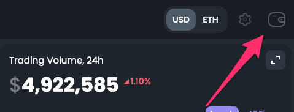
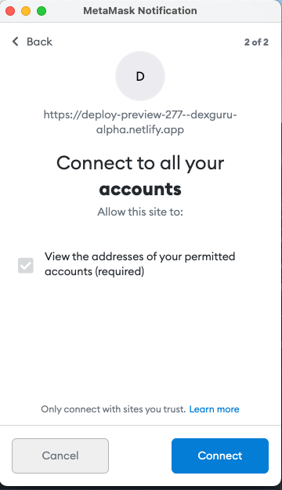
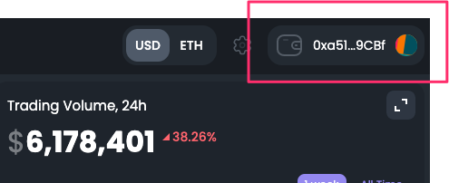
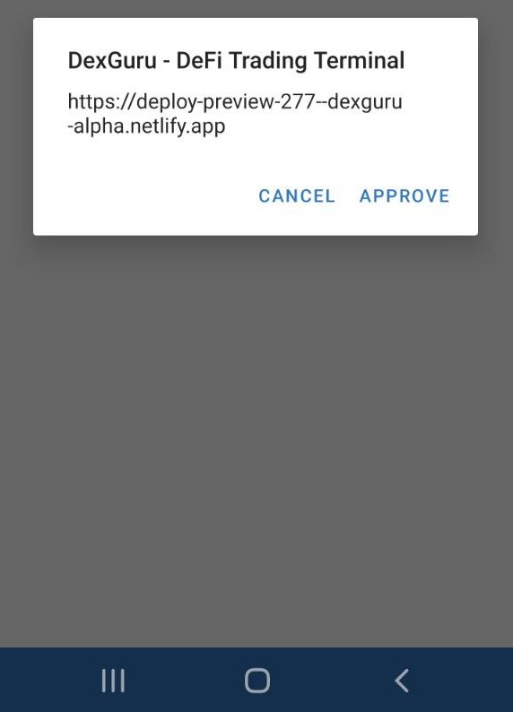
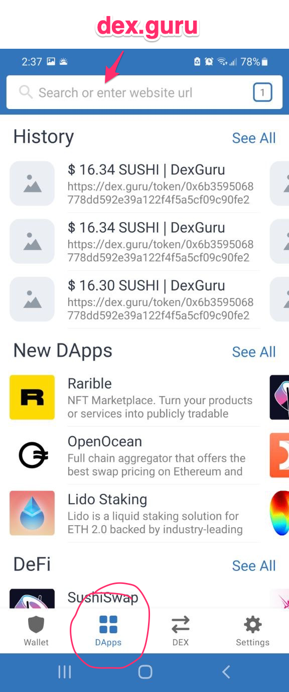
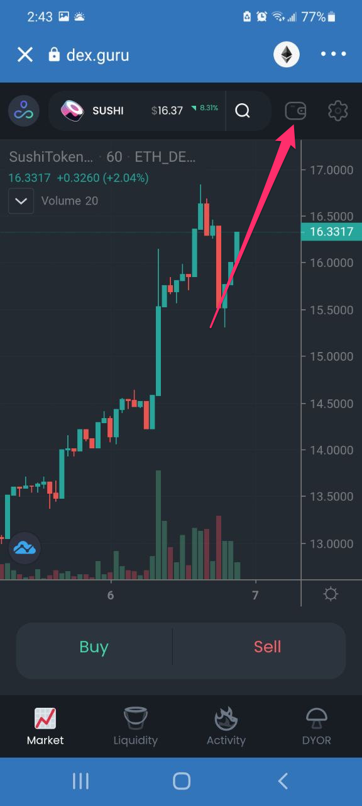
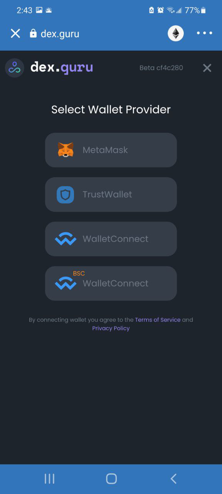
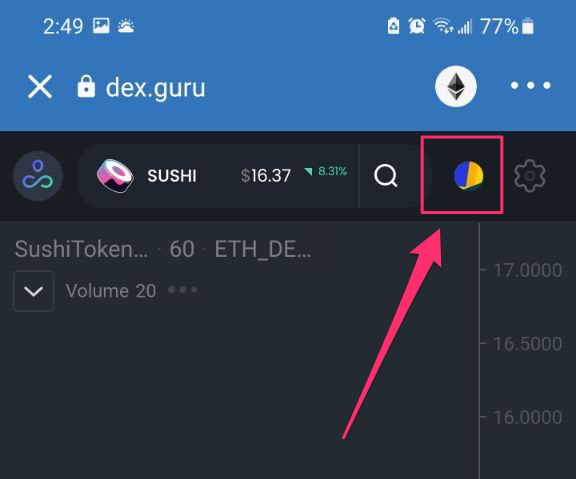

# Connect wallet

## On desktop 

### Browser wallets such as Metamask

Click on a wallet icon at the top right corner 

Choose Metamask 

Click connect button at Metamask 

All set: 

### Walletconnect

Click on a wallet icon at the top right corner 

Choose Walletconnect 

Scan QR code from your screen with a walletconnect-compatible wallet, and approve connection: 

All set: 

## On mobile 

You need to have your web3 wallet app installed on your phone. Go to your wallet app and look for the browser there. Now go to dex.guru

Click on a wallet icon at the top right corner 

Click on Metamask or Trustwallet 

All set: 

