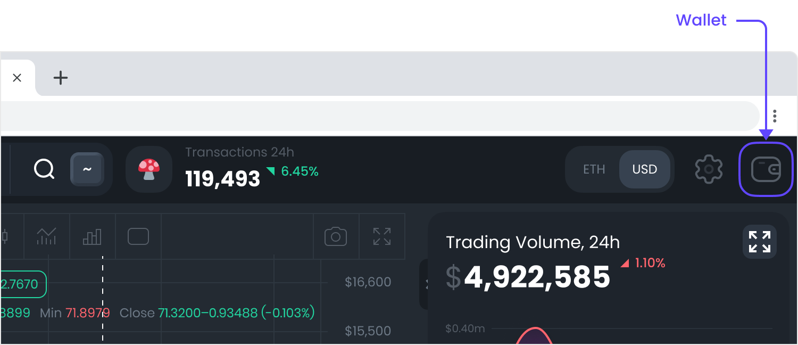

# Connect wallet

## On desktop&#x20;

### Browser wallets such as Metamask

Click on a wallet icon at the top right corner&#x20;

Choose Metamask&#x20;

Click connect button at Metamask&#x20;

All set:&#x20;

### WalletConnect

**Note: **To use WalletConect you need to disable or delete the MetaMask extension on the desktop browser because it causes conflicts with other wallet providers. Another option is to use Incognito mode.&#x20;

Click on a wallet icon at the top right corner&#x20;

Choose Walletconnect&#x20;

Scan QR code from your screen with a walletconnect-compatible wallet, and approve connection:&#x20;

All set:&#x20;

## On mobile&#x20;

You need to have your web3 wallet app installed on your phone. Go to your wallet app and look for the browser there. Now go to dex.guru

Click on a wallet icon at the top right corner&#x20;

Click on Metamask or Trustwallet&#x20;

All set:&#x20;

